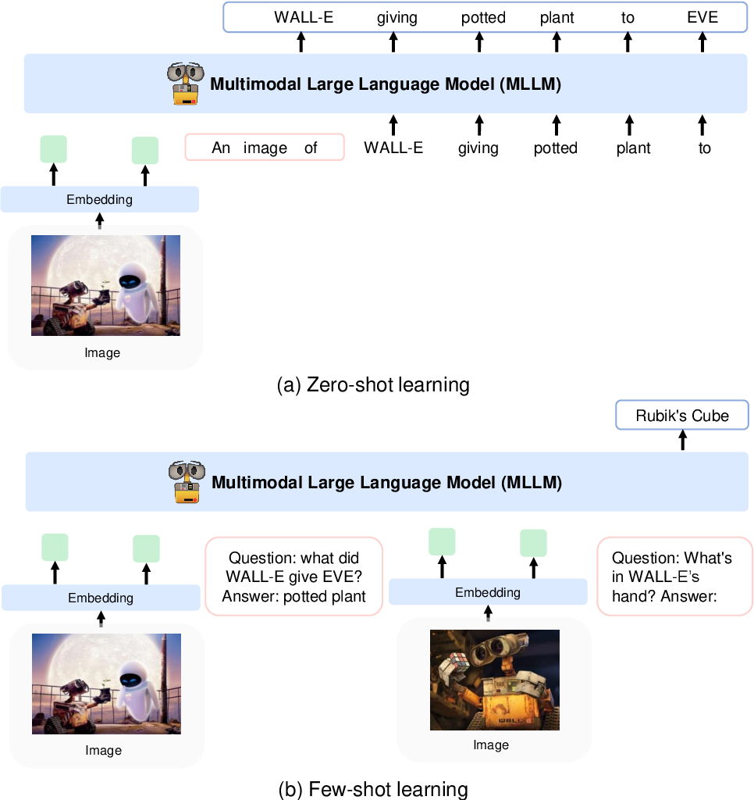
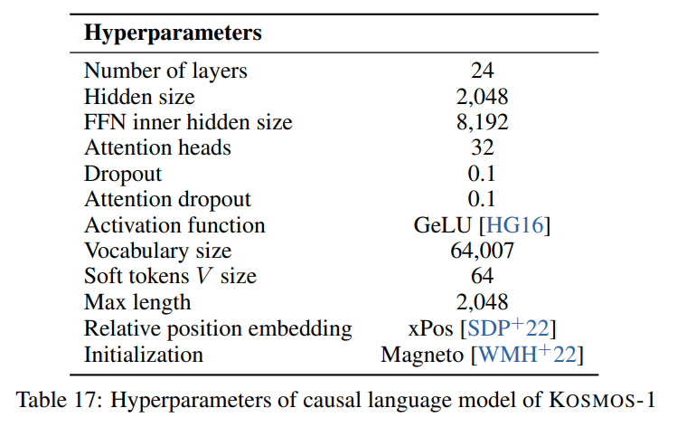

[](https://discord.gg/qUtxnK2NMf)

# Kosmos-X: Advanced Multi-Modality AI Model 🚀🌌



[](https://github.com/kyegomez/Kosmos-X/issues) 
[](https://github.com/kyegomez/Kosmos-X/network) 
[](https://github.com/kyegomez/Kosmos-X/stargazers) 
[](https://github.com/kyegomez/Kosmos-X/blob/main/LICENSE)

[](https://twitter.com/intent/tweet?text=Check%20out%20this%20amazing%20AI%20project:%20Kosmos-X&url=https%3A%2F%2Fgithub.com%2Fkyegomez%2FKosmos-X) 
[](https://www.facebook.com/sharer/sharer.php?u=https%3A%2F%2Fgithub.com%2Fkyegomez%2FKosmos-X) 
[](https://www.linkedin.com/shareArticle?mini=true&url=https%3A%2F%2Fgithub.com%2Fkyegomez%2FKosmos-X&title=&summary=&source=)

[](https://www.reddit.com/submit?url=https%3A%2F%2Fgithub.com%2Fkyegomez%2FKosmos-X&title=Kosmos-X%20-%20the%20next%20generation%20AI%20shields) 
[](https://news.ycombinator.com/submitlink?u=https%3A%2F%2Fgithub.com%2Fkyegomez%2FKosmos-X&t=Kosmos-X%20-%20the%20next%20generation%20AI%20shields) 
[](https://pinterest.com/pin/create/button/?url=https%3A%2F%2Fgithub.com%2Fkyegomez%2FKosmos-X&media=https%3A%2F%2Fexample.com%2Fimage.jpg&description=Kosmos-X%20-%20the%20next%20generation%20AI%20shields) 
[](https://api.whatsapp.com/send?text=Check%20out%20Kosmos-X%20-%20the%20next%20generation%20AI%20shields%20%23Kosmos-X%20%23AI%0A%0Ahttps%3A%2F%2Fgithub.com%2Fkyegomez%2FKosmos-X)


Kosmos-X is a modular Multi-Modality AI model designed to seamlessly process diverse forms of data, including:

* Images
* Videos
* Audio
* Any type

At lightspeed with ultra-reliability.

The unique strength of Kosmos-X lies in its ability to process extremely long sequences of these multi-modality inputs, with context lengths of up to 40,000+!

## Model Roadmap
[Help us create a Model Roadmap on Kosmos-X Figma](https://www.figma.com/file/z3sNPzuB3thdOKT7oml6NI/Kosmos-X?type=whiteboard&node-id=1%3A142&t=Z37mybFxYALukurx-1)

----

## Ready for Training!

Kosmos-X is now ready for training, and we're actively seeking cloud providers or grant providers to collaborate in training this revolutionary model and eventually release it open source. If you're interested in learning more or supporting this endeavor, please feel free to email me at `kye@apac.ai`.

---

## Appreciation
* All the creators in Agora, [Join Agora](https://discord.gg/qUtxnK2NMf) the community of AI engineers changing the world with their creations.
* LucidRains for inspiring me to devote myself to open source AI

---

## Installation
```bash
pip install kosmosx
```

## Usage

```python
import torch
from kosmosx.model import Kosmos

# Create a sample text token tensor
text_tokens = torch.randint(0, 32002, (1, 50), dtype=torch.long)

# Create a sample image tensor
images = torch.randn(1, 3, 224, 224)

# Instantiate the model
model = Kosmos()

# Pass the sample tensors to the model's forward function
output = model.forward(
    text_tokens=text_tokens,
    images=images
)

# Print the output from the model
print(f"Output: {output}")

```

# Training

`accelerate config`

then: `accelerate launch train_distributed.py`

## Get Involved

We're just at the beginning of our journey. As we continue to develop and refine Kosmos-X, we invite you to join us. Whether you're a developer, researcher, or simply an enthusiast, your insights and contributions can help shape the future of Kosmos-X.

# Contributing to Kosmos-X

We are thrilled to invite you to be a part of the Kosmos-X project. This is not just an open source project but a community initiative, and we value your expertise and creativity. To show our appreciation, we have instituted a unique rewards system that directly compensates contributors from the revenue generated by the Kosmos-X API.

## Why Contribute

Contributing to Kosmos-X not only enhances your skills and profile but also comes with financial rewards. When you contribute code, documentation, or any form of improvement to the Kosmos-X project, you are adding value. As such, we believe it's only fair that you share in the rewards.

---

## The model
KOSMOS-1 uses a decoder-only Transformer architecture based on [Magneto (Foundation Transformers)](https://arxiv.org/abs/2210.06423), i.e. an architecture that employs a so called sub-LN approach where layer normilization is added both before the attention module (pre-ln) and afterwards (post-ln) combining the advantages that either approaches have for language modelling and image understanding respectively. The model is also initialized according to a specific metric also described in the paper, allowing for more stable training at higher learning rates.

They encode images to image features using a CLIP VIT-L/14 model and use a [perceiver resampler](https://github.com/lucidrains/flamingo-pytorch) introduced in [Flamingo](https://www.deepmind.com/blog/tackling-multiple-tasks-with-a-single-visual-language-model) to pool the image features from `256 -> 64` tokens. The image features are combined with the token embeddings by adding them to the input sequence surrounded by special tokens `<image>` and `</image>`. An example is `<s> <image> image_features </image> text </s>`. This allows image(s) to be interwoven with text in the same sequence.

We follow the hyperparameters described in the paper visible in the following image:



## Details
### Model (decoder)
We use the torchscale implementation of the decoder-only Transformer architecture from Foundation Transformers:
    
```python
from torchscale.architecture.config import DecoderConfig
from torchscale.architecture.decoder import Decoder

config = DecoderConfig(
    decoder_layers=24,
    decoder_embed_dim=2048,
    decoder_ffn_embed_dim=8192,
    decoder_attention_heads=32,
    dropout=0.1,
    activation_fn="gelu",
    attention_dropout=0.1,
    vocab_size=32002,
    subln=True,                 # sub-LN approach
    xpos_rel_pos=True,          # rotary positional embeddings
    max_rel_pos=2048
)
decoder = Decoder(
    config,
    embed_tokens=embed,
    embed_positions=embed_positions,
    output_projection=output_projection
)
```


### CLIP VIT-L/14
For the image model (CLIP VIT-L/14) we use a pretrained OpenClip model:

```python
from transformers import CLIPModel
clip_model = CLIPModel.from_pretrained("laion/CLIP-ViT-L-14-laion2B-s32B-b82K").vision_model
# projects image to [batch_size, 256, 1024]
features = clip_model(pixel_values=images)["last_hidden_state"]
```

### Perceiver Resampler
We follow the default hyperparams for the perceiver resampler as no hyperparams are given in the paper:

```python
from flamingo_pytorch import PerceiverResampler
perceiver = PerceiverResampler(
    dim = 1024,
    depth = 2,
    dim_head = 64,
    heads = 8,
    num_latents = 64,
    num_media_embeds = 256
)
# projects image features to [batch_size, 64, 1024]
self.perceive(images).squeeze(1)
```

Because the model expects a hidden dimension of `2048`, we use a `nn.Linear` layer to project the image features to the correct dimension and initialize it according to Magneto's initialization scheme:

```python
image_proj = torch.nn.Linear(1024, 2048, bias=False)
torch.nn.init.normal_(
    image_proj.weight, mean=0, std=2048**-0.5
)
scaled_image_features = image_proj(image_features)
```

### Tokenizer
The paper describes a [SentencePiece](https://github.com/google/sentencepiece) with a vocabulary of `64007` tokens. For simplicity (as we don't have the training corpus available), we use the next best open-source alternative which is the pretrained [T5-large tokenizer](https://huggingface.co/t5-large) from HuggingFace. This tokenizer has a vocabulary of `32002` tokens.

```python
from transformers import T5Tokenizer
tokenizer = T5Tokenizer.from_pretrained(
    "t5-large",
    additional_special_tokens=["<image>", "</image>"],
    extra_ids=0,
    model_max_length=1984 # 2048 - 64 (image features)
)
```
We then embed the tokens with a `nn.Embedding` layer. We actually use a `bnb.nn.Embedding` from
[bitandbytes](https://github.com/TimDettmers/bitsandbytes) which allows us to use 8-bit AdamW later.

```python
import bitsandbytes as bnb
embed = bnb.nn.Embedding(
    32002,          # Num embeddings
    2048,           # Embedding dim
    padding_idx
)
```

For positional embeddings, we use:
```python
from torchscale.component.embedding import PositionalEmbedding
embed_positions= PositionalEmbedding(
    2048,           # Num embeddings
    2048,           # Embedding dim
    padding_idx
)
```

Also, we add an output projection layer to project the hidden dimension to the vocabulary size and initialize it according to Magneto's initialization scheme:
```python
output_projection = torch.nn.Linear(
    2048, 32002, bias=False
)
torch.nn.init.normal_(
    output_projection.weight, mean=0, std=2048**-0.5
)
```

### Decoder changes
I had to make some slight changes to the decoder to allow it to accept already embedded features in the forward pass. This was necessary to allow the more complex input sequence described above. The changes are visible in the following diff in line 391 of `torchscale/architecture/decoder.py`:

```diff
+if kwargs.get("passed_x", None) is None:
+    x, _ = self.forward_embedding(
+        prev_output_tokens, token_embeddings, incremental_state
+    )
+else:
+    x = kwargs["passed_x"]

-x, _ = self.forward_embedding(
-    prev_output_tokens, token_embeddings, incremental_state
-)
```


---


### Dataset Strategy


Here is a markdown table with metadata for the datasets mentioned in the paper:

| Dataset | Description | Size | Link | 
|-|-|-|-|
| The Pile | Diverse English text corpus | 800 GB | [Huggingface](https://huggingface.co/datasets/the_pile) |
| Common Crawl | Web crawl data | - | [Common Crawl](https://commoncrawl.org/) |  
| LAION-400M | Image-text pairs from Common Crawl | 400M pairs | [Huggingface](https://huggingface.co/datasets/laion400m) |  
| LAION-2B | Image-text pairs from Common Crawl | 2B pairs | [ArXiv](https://arxiv.org/abs/2112.05251) |
| COYO | Image-text pairs from Common Crawl | 700M pairs | [Github](https://github.com/clovaai/coyo) |  
| Conceptual Captions | Image-alt text pairs | 15M pairs | [ArXiv](https://arxiv.org/abs/2103.01950) |
| Interleaved CC Data | Text and images from Common Crawl | 71M docs | Custom dataset |
| StoryCloze | Commonsense reasoning | 16k examples | [ACL Anthology](https://aclanthology.org/W17-0906/) |
| HellaSwag | Commonsense NLI | 70k examples | [ArXiv](https://arxiv.org/abs/1905.02875) |
| Winograd Schema | Word ambiguity | 273 examples | [PKRR 2012](https://doi.org/10.24963/kr.2012/26) |
| Winogrande | Word ambiguity | 1.7k examples | [AAAI 2020](https://arxiv.org/abs/1907.10641) |  
| PIQA | Physical commonsense QA | 16k examples | [AAAI 2020](https://arxiv.org/abs/1911.11641) |
| BoolQ | QA | 15k examples | [ACL 2019](https://aclanthology.org/N19-1246/) |
| CB | Natural language inference | 250 examples | [Sinn und Bedeutung 2019](https://semanticsarchive.net/Archive/DlZGNjZm/) | 
| COPA | Causal reasoning | 1k examples | [AAAI Spring Symposium 2011](https://www.aaai.org/ocs/index.php/SSS/SSS11/paper/download/2418/2874) |
| RelativeSize | Commonsense reasoning | 486 pairs | [ArXiv 2016](https://arxiv.org/abs/1602.00753) |
| MemoryColor | Commonsense reasoning | 720 examples | [ArXiv 2021](https://arxiv.org/abs/2109.11321) |
| ColorTerms | Commonsense reasoning | 320 examples | [ACL 2012](https://aclanthology.org/P12-2018/) |
| IQ Test | Nonverbal reasoning | 50 examples | Custom dataset |
| COCO Captions | Image captioning | 413k images | [PAMI 2015](https://doi.org/10.1109/TPAMI.2014.2366765) |  
| Flickr30k | Image captioning | 31k images | [TACL 2014](https://aclanthology.org/Q14-1010/) |
| VQAv2 | Visual QA | 1M QA pairs | [CVPR 2017](https://openaccess.thecvf.com/content_cvpr_2017/papers/Goyal_Making_the_V_CVPR_2017_paper.pdf) |  
| VizWiz | Visual QA | 31k QA pairs | [CVPR 2018](https://openaccess.thecvf.com/content_cvpr_2018/papers/Gurari_VizWiz_Grand_Challenge_CVPR_2018_paper.pdf) |
| WebSRC | Web QA | 1.4k examples | [EMNLP 2021](https://aclanthology.org/2021.emnlp-main.261/) |  
| ImageNet | Image classification | 1.28M images | [CVPR 2009](https://doi.org/10.1109/CVPRW.2009.5206848) |
| CUB | Image classification | 200 bird species | [TOG 2011](https://vision.cornell.edu/se3/wp-content/uploads/2013/03/CUB_200_2011.pdf) |


----

# Training

* We're actively seeking cloud providers or grant providers to train this all-new revolutionary model and release it open source, if you would like to learn more please email me at kye@apac.ai

----

### TODO

* Integrate flash attention inside the `torchscale/component/multihead_attention.py`

* Integrate one write head is all you need

* Look into integrating qk_norm

* Look into integrating Falcon LLM model tokenizer if they allow special tokens

* Prepare datasets, training strategies, and infrastructure for massive production level traning

* Run tests and make sure trains well with all optimizations on small dataset

