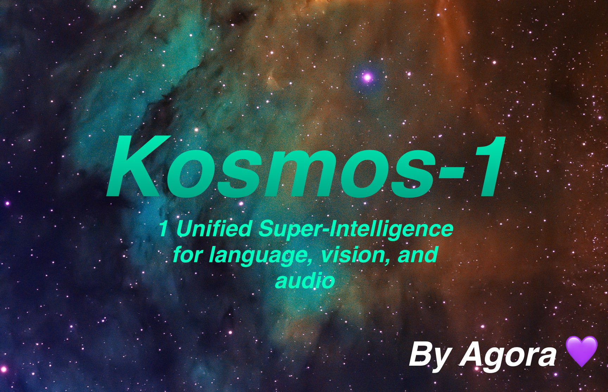

# KOSMOS-1 Multimodal LLM



This repository is a rudimentary reimplementation of the KOSMOS-1 model described in Microsofts recent paper [Language Is Not All You Need: Aligning Perception
with Language Models](https://arxiv.org/pdf/2302.14045.pdf). Since the code is yet to be published at
[microsoft/unilm](https://github.com/microsoft/unilm), this is an attempt to follow what is described in the paper as close as possible.

## Installation
This repo requires [apex](https://github.com/NVIDIA/apex#from-source) and [torchscale](https://github.com/microsoft/torchscale) to be installed from source:
```bash
# Basic requirements (transformers, torch, etc.)
pip install -r requirements.txt

# apex
git clone https://github.com/NVIDIA/apex
cd apex
pip install -v --disable-pip-version-check --no-cache-dir --global-option="--cpp_ext" --global-option="--cuda_ext" ./

# Kosmos-X
git clone https://github.com/kyegomez?tab=repositories
cd Kosmos-X
pip install -r requirements.txt
cd training
python3 train_kosmos.py

```

## The model
KOSMOS-1 uses a decoder-only Transformer architecture based on [Magneto (Foundation Transformers)](https://arxiv.org/abs/2210.06423), i.e. an architecture that employs a so called sub-LN approach where layer normilization is added both before the attention module (pre-ln) and afterwards (post-ln) combining the advantages that either approaches have for language modelling and image understanding respectively. The model is also initialized according to a specific metric also described in the paper, allowing for more stable training at higher learning rates.

They encode images to image features using a CLIP VIT-L/14 model and use a [perceiver resampler](https://github.com/lucidrains/flamingo-pytorch) introduced in [Flamingo](https://www.deepmind.com/blog/tackling-multiple-tasks-with-a-single-visual-language-model) to pool the image features from `256 -> 64` tokens. The image features are combined with the token embeddings by adding them to the input sequence surrounded by special tokens `<image>` and `</image>`. An example is `<s> <image> image_features </image> text </s>`. This allows image(s) to be interwoven with text in the same sequence.

We follow the hyperparameters described in the paper visible in the following image:


## Details
### Model (decoder)
We use the torchscale implementation of the decoder-only Transformer architecture from Foundation Transformers:
    
```python
from torchscale.architecture.config import DecoderConfig
from torchscale.architecture.decoder import Decoder

config = DecoderConfig(
    decoder_layers=24,
    decoder_embed_dim=2048,
    decoder_ffn_embed_dim=8192,
    decoder_attention_heads=32,
    dropout=0.1,
    activation_fn="gelu",
    attention_dropout=0.1,
    vocab_size=32002,
    subln=True,                 # sub-LN approach
    xpos_rel_pos=True,          # rotary positional embeddings
    max_rel_pos=2048
)
decoder = Decoder(
    config,
    embed_tokens=embed,
    embed_positions=embed_positions,
    output_projection=output_projection
)
```


### CLIP VIT-L/14
For the image model (CLIP VIT-L/14) we use a pretrained OpenClip model:

```python
from transformers import CLIPModel
clip_model = CLIPModel.from_pretrained("laion/CLIP-ViT-L-14-laion2B-s32B-b82K").vision_model
# projects image to [batch_size, 256, 1024]
features = clip_model(pixel_values=images)["last_hidden_state"]
```

### Perceiver Resampler
We follow the default hyperparams for the perceiver resampler as no hyperparams are given in the paper:

```python
from flamingo_pytorch import PerceiverResampler
perceiver = PerceiverResampler(
    dim = 1024,
    depth = 2,
    dim_head = 64,
    heads = 8,
    num_latents = 64,
    num_media_embeds = 256
)
# projects image features to [batch_size, 64, 1024]
self.perceive(images).squeeze(1)
```

Because the model expects a hidden dimension of `2048`, we use a `nn.Linear` layer to project the image features to the correct dimension and initialize it according to Magneto's initialization scheme:

```python
image_proj = torch.nn.Linear(1024, 2048, bias=False)
torch.nn.init.normal_(
    image_proj.weight, mean=0, std=2048**-0.5
)
scaled_image_features = image_proj(image_features)
```

### Tokenizer
The paper describes a [SentencePiece](https://github.com/google/sentencepiece) with a vocabulary of `64007` tokens. For simplicity (as we don't have the training corpus available), we use the next best open-source alternative which is the pretrained [T5-large tokenizer](https://huggingface.co/t5-large) from HuggingFace. This tokenizer has a vocabulary of `32002` tokens.

```python
from transformers import T5Tokenizer
tokenizer = T5Tokenizer.from_pretrained(
    "t5-large",
    additional_special_tokens=["<image>", "</image>"],
    extra_ids=0,
    model_max_length=1984 # 2048 - 64 (image features)
)
```
We then embed the tokens with a `nn.Embedding` layer. We actually use a `bnb.nn.Embedding` from
[bitandbytes](https://github.com/TimDettmers/bitsandbytes) which allows us to use 8-bit AdamW later.

```python
import bitsandbytes as bnb
embed = bnb.nn.Embedding(
    32002,          # Num embeddings
    2048,           # Embedding dim
    padding_idx
)
```

For positional embeddings, we use:
```python
from torchscale.component.embedding import PositionalEmbedding
embed_positions= PositionalEmbedding(
    2048,           # Num embeddings
    2048,           # Embedding dim
    padding_idx
)
```

Also, we add an output projection layer to project the hidden dimension to the vocabulary size and initialize it according to Magneto's initialization scheme:
```python
output_projection = torch.nn.Linear(
    2048, 32002, bias=False
)
torch.nn.init.normal_(
    output_projection.weight, mean=0, std=2048**-0.5
)
```

### Decoder changes
I had to make some slight changes to the decoder to allow it to accept already embedded features in the forward pass. This was necessary to allow the more complex input sequence described above. The changes are visible in the following diff in line 391 of `torchscale/architecture/decoder.py`:

```diff
+if kwargs.get("passed_x", None) is None:
+    x, _ = self.forward_embedding(
+        prev_output_tokens, token_embeddings, incremental_state
+    )
+else:
+    x = kwargs["passed_x"]

-x, _ = self.forward_embedding(
-    prev_output_tokens, token_embeddings, incremental_state
-)
```

### Training
Since we have neither the data nor the capacity to do actual training, the details of the training process are omitted here (even though these might be the most interesting parts of the paper). We provide
code for a very simple single dataset training loop using [accelerate](https://github.com/huggingface/accelerate) in `train_kosmos.py`. This part is still very much WIP.

### TODO

-Train right now on VQA dataset and make sure that it works

- Integrate Flash MultiHead Attention, with xpos, and alibipos in attention in torchscale for fast and ultra long sequences

- Prepare datasets, training strategies, and infrastructure for massive production level traning
